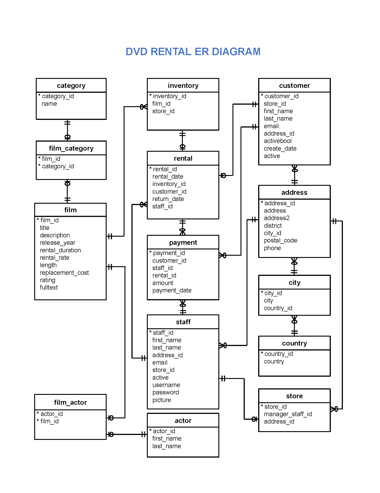
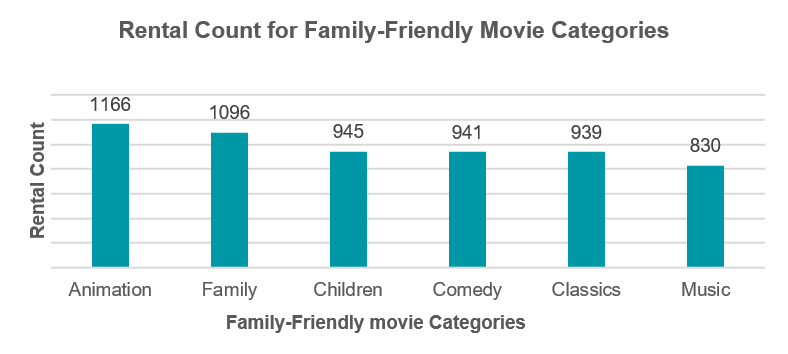
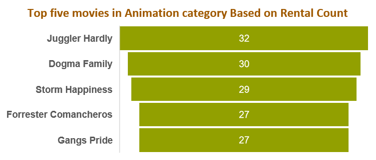
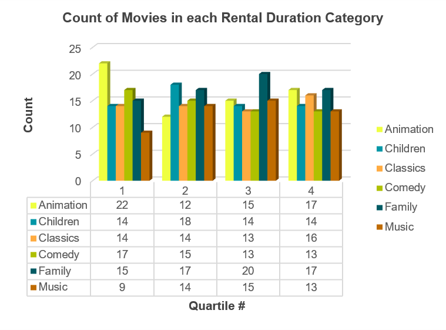
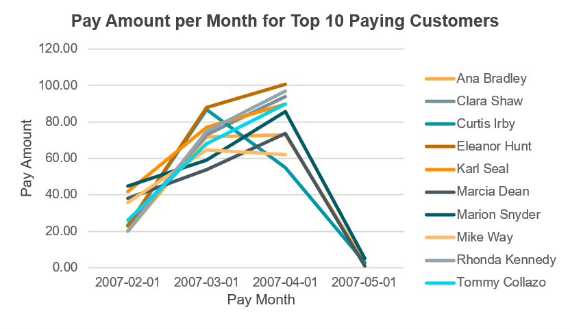
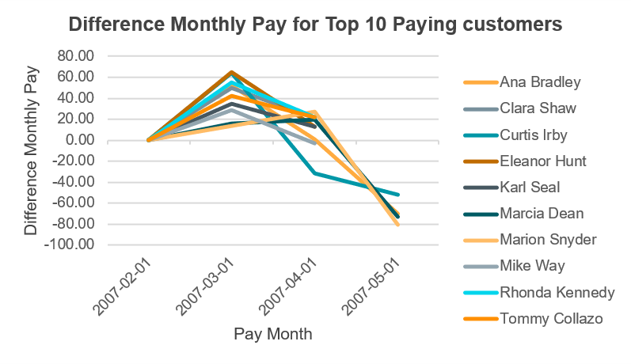
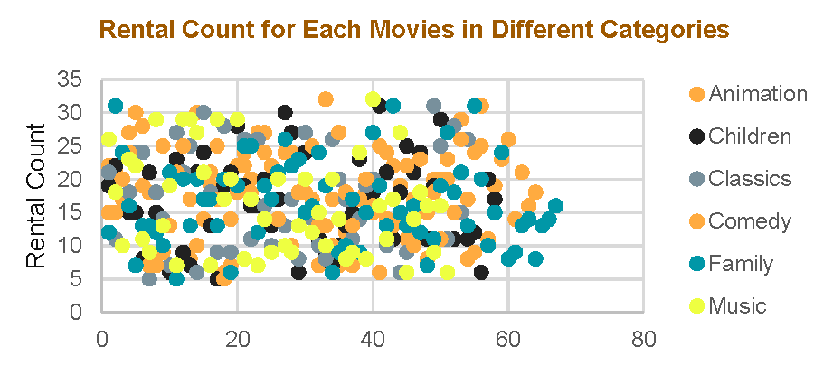

# Analysis of Movie Rentals Database 

### Introduction
I've just finished the [Nanodegree Program: Programming for Data Science With Python](https://learn.udacity.com/nanodegrees/nd104) at [Udacity](https://www.udacity.com) and this project was a part of my Nanodegree study.

### Dataset
**Sakila DVD Rental database** <br>
The Sakila Database holds information about a company that rents movie DVDs.<br>
For this project, I queried the database to gain an understanding of the customer base, such as what the patterns in movie watching are across different customer groups, how they compare on payment earnings, and how the stores compare in their performance. <br>
And here is the schema for the DVD Rental database is provided below.



* actor — contains actors data including first name and last name.
* film — contains films data such as title, release year, length, rating, etc.
* film_actor — contains the relationships between films and actors.
* category — contains film’s categories data.
* film_category — containing the relationships between films and categories.
* store — contains the store data including manager staff and address.
* inventory — stores inventory data.
* rental — stores rental data.
* payment — stores customer’s payments.
* staff — stores staff data.
* customer — stores customer’s data.
* address — stores address data for staff and customers
* city — stores the city names.
* country — stores the country names.

### Objective & Goals
**In this project, I answered the following questions:**
1) Which is the most popular category in Family-Friendly movies?
2) Which films in this category are the top five most popular?
3) Which category of Family-Friendly movies, is more popular in each quartile based on their rental duration?
4) Who are the top 10 paying customers during 2007?
5) Among the top 10 paying customers in 2007, who has the most difference in monthly payments?
6) Show Rental Count for Each Movies in Different Categories.


### Analysis
1) Which is the most popular category in Family-Friendly movies?
To answer this question first let`s look at the query used to answer this question.
```sql
SELECT 
	c.name AS movie_category,
	count(r.rental_id) AS rental_count
FROM film f 
JOIN film_category fc 
	ON f.film_id = fc.film_id
JOIN category c 
	ON fc.category_id = c.category_id 
	AND c.name in ('Animation', 'Children', 'Classics', 'Comedy', 'Family', 'Music')
JOIN inventory i 
	ON i.film_id = f.film_id
JOIN rental r 
	on r.inventory_id = i.inventory_id
GROUP BY c.name
ORDER BY 2 desc;

```



Displays the total number of rentals for each category in the Family-Friendly movie group. It indicates that the “Animation” category is the most common among Family-Friendly movies.
<br>

2) Which films in this category are the top five most popular?
To answer this question first let`s look at the query used to answer this question.
```sql
SELECT s.*
FROM (
	SELECT 
		f.title AS movie_title,
		COUNT(r.rental_id) AS movie_rental_count
	FROM film f 
	JOIN film_category fc 
		ON f.film_id = fc.film_id
	JOIN category c 
		ON fc.category_id = c.category_id 
		AND c.name = 'Animation'
	JOIN inventory i 
		ON i.film_id = f.film_id
	JOIN rental r 
		on r.inventory_id = i.inventory_id
	GROUP BY f.title
	ORDER BY 2 DESC ) s
LIMIT 5;

```


This chart shows the top five movies in the “Animation” category based on their number of rentals.
<br>

3) Which category of Family-Friendly movies, is more popular in each quartile based on their rental duration?
First, let`s look at the query used to answer this question.
```sql
SELECT ff.film_category, ff.standard_quartile, COUNT(*) count
FROM 
	(SELECT 
		f.title AS film_title,
		c.name AS film_category,
		f.rental_duration,
		NTILE(4) OVER (order BY f.rental_duration) AS standard_quartile
	 FROM film f
	 JOIN film_category fc 
	 	ON f.film_id = fc.film_id
	 JOIN category c 
	 	ON fc.category_id = c.category_id 
	 	AND c.name IN ('Animation', 'Children', 'Classics', 'Comedy', 'Family','Music')
	) ff
GROUP BY ff.film_category, ff.standard_quartile
ORDER BY 1,2;

```


This chart shows that the "Animation" category is more common in the first quartile of the "Rental Duration" quartiles, followed by the "Children" category in the second quartile, the "Family" category in the third quartile, and the "Animation" and "Family" categories in the fourth quartile, respectively.
<br>

4) Who are the top 10 paying customers during 2007?

To answer this question first let`s look at the query used to answer this question.
```sql
SELECT 
	date_trunc('month', pp.payment_date) pay_month,
	cr.fullname,		
	COUNT(pp.payment_id) pay_count_per_month,
	SUM(pp.amount) pay_amount
FROM 
	(SELECT 
	 	ff.customer_id,
		ff.fullname,
		pay_count,
		pay_amount,
		RANK() OVER (ORDER BY pay_amount DESC, pay_count DESC) customer_rank
	FROM
		(SELECT 
		    c.customer_id,
			concat(c.first_name,' ',c.last_name) fullname,
			COUNT(p.payment_id) pay_count,
			SUM(p.amount) pay_amount
		FROM payment p
		JOIN customer c 
		 	ON p.customer_id = c.customer_id
		WHERE date_part('year', p.payment_date)=2007
		GROUP BY 1,2
		) ff
	) cr
JOIN payment pp 
	ON cr.customer_id = pp.customer_id 
	AND cr.customer_rank <= 10	
GROUP BY 1,2	
ORDER BY 2,1;

```



This graph shows how much the top 10 buyers paid each month from February to May 2007.
The names of the top 10 buyers are listed on the right side of the chart.
<br>

5) Among the top 10 paying customers in 2007, who has the most difference in monthly payments?

To answer this question first let`s look at the query used to answer this question.
```sql
SELECT 
	pay_month,
	fullname,
	pay_count_per_month,
	pay_amount,	 
	pay_amount - LAG(pay_amount) OVER (PARTITION BY fullname ORDER BY pay_month) AS lag_difference 
FROM 
	(SELECT 
		date_trunc('month', pp.payment_date) pay_month,
		cr.fullname,		
		COUNT(pp.payment_id) pay_count_per_month,
		SUM(pp.amount) pay_amount
	FROM 
		(SELECT 
			ff.customer_id,
			ff.fullname,
			pay_count,
			pay_amount,
			RANK() OVER (ORDER BY pay_amount DESC, pay_count DESC) customer_rank
		FROM
			(SELECT 
				c.customer_id,
				concat(c.first_name,' ',c.last_name) fullname,
				COUNT(p.payment_id) pay_count,
				SUM(p.amount) pay_amount
			FROM payment p
			JOIN customer c on p.customer_id = c.customer_id
			and date_part('year', p.payment_date)=2007
			GROUP BY 1,2) ff
		) cr
	JOIN payment pp ON cr.customer_id=pp.customer_id AND cr.customer_rank <= 10	
	GROUP BY 1,2) topc
ORDER BY fullname, pay_month;

```



This graph displays, the difference in monthly payments for each top-paying customer. As shown, "Marion Snyder" has the greatest difference of -80.83 from April to May in 2007.
<br>

6) Show Rental Count for Each Movies in Different Categories.
To answer this question first let`s look at the query used to answer this question.

```sql
SELECT 
	f.title AS movie_title, 
	c.name AS movie_category, 
	COUNT(r.rental_id) AS rental_count
FROM film f
JOIN film_category fc 
	ON f.film_id = fc.film_id
JOIN category c 
	ON fc.category_id = c.category_id 
	AND c.name in ('Animation', 'Children', 'Classics', 'Comedy', 'Family', 'Music')
JOIN inventory i 
	ON i.film_id = f.film_id
JOIN rental r 
	on r.inventory_id = i.inventory_id
GROUP BY f.title,c.name
ORDER BY 2,1;

```



In this plot, each point is a movie, its color shows its category and its place shows its rental count.
<br>
